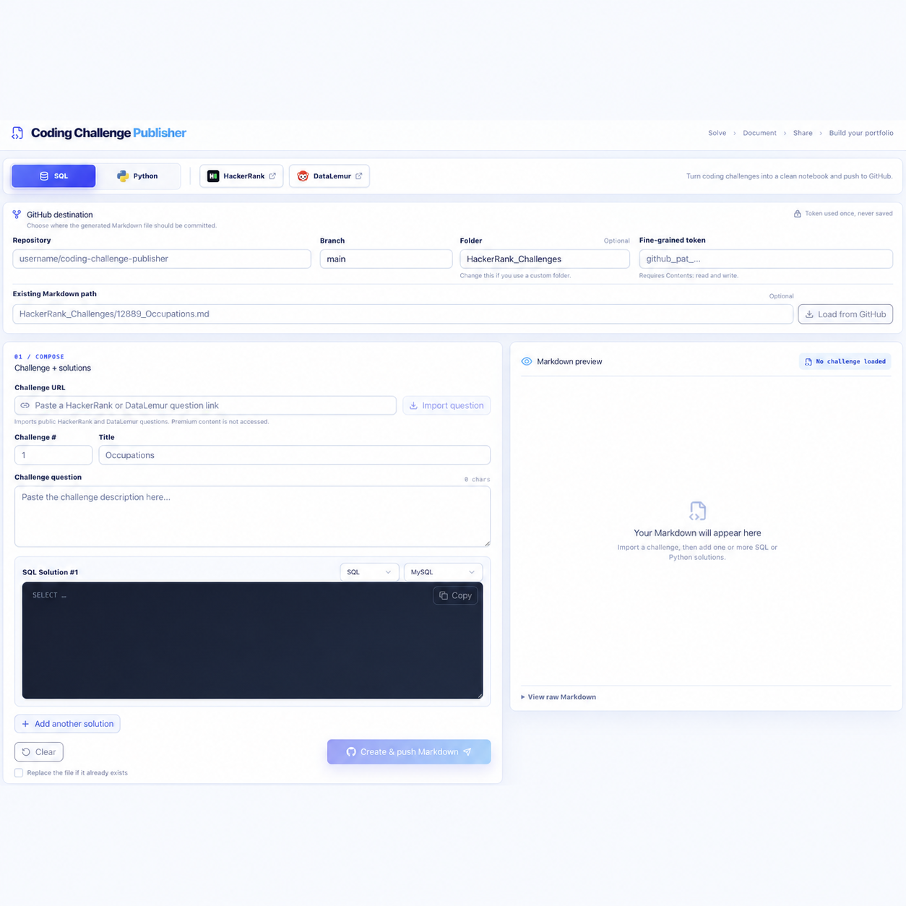

<h1 align="left">
  
  Coding Challenge Publisher
</h1>

Coding Challenge Publisher is a reusable challenge journal and publishing application for anyone who wants to organize SQL and Python practice solutions on GitHub. Each challenge is stored as an individual Markdown file containing the public problem statement, a link to the original HackerRank, DataLemur, or LeetCode challenge, and one or more documented solutions.

This `main` branch demonstrates the Markdown produced by the public [Coding Challenge Publisher](https://challenge-publisher.das-reemika.chatgpt.site/). The application source is maintained on the [`WebApp` branch](https://github.com/reemikadas/Coding-Challenge-Publisher/tree/WebApp).

## Challenges solved

<!-- challenge-counts:start -->
|  | HackerRank | DataLemur | LeetCode | Total Challenges Solved |
| --- | ---: | ---: | ---: | ---: |
| SQL | 29 | 54 | 21 | 104 |
| Python | 7 | 6 | 0 | 13 |
| **Total** | **36** | **60** | **21** | **117** |
<!-- challenge-counts:end -->

These totals are updated automatically when Markdown files are added to the HackerRank, DataLemur, or LeetCode SQL and Python challenge folders.

## Coding Challenge Publisher web app

## What the web app supports

- Public HackerRank, DataLemur, and LeetCode challenge URLs.
- SQL solutions using MySQL or PostgreSQL.
- Python solutions using Python 3.
- Multiple SQL and Python solutions in one Markdown file.
- Filenames in `<Challenge #>_<Title>.md` format.
- Markdown preview before publishing.
- Direct publishing to a selected GitHub repository, branch, and folder.
- Loading an existing Markdown file from GitHub for future edits.

## Step-by-step guide

1. Open [Coding Challenge Publisher](https://challenge-publisher.das-reemika.chatgpt.site/).
2. Create or choose a GitHub repository where you have permission to commit files.
3. Under **GitHub destination**, enter:
   - **Repository:** `owner/repository`, such as `your-username/Coding-Challenge-Publisher`.
   - **Branch:** an existing branch, usually `main`.
   - **Folder:** the directory for the Markdown files. The app suggests provider- and language-specific folders; you can change this value or leave it blank for the repository root.
4. Create a fine-grained GitHub token:
   1. Open GitHub's [New fine-grained personal access token](https://github.com/settings/personal-access-tokens/new) page.
   2. Enter a descriptive token name and choose an expiration date.
   3. Set **Resource owner** to the account or organization that owns the destination repository.
   4. Under **Repository access**, select **Only select repositories**, then choose the destination repository.
   5. Under **Repository permissions**, set **Contents** to **Read and write**. No additional repository permission is required for these Markdown files.
   6. Select **Generate token**, copy it immediately, and paste it into **Fine-grained token** in the web app.
   7. Keep the token private. Revoke or rotate it from GitHub settings if it is exposed.
5. Select **SQL** or **Python** at the top of the app.
6. Select the HackerRank, DataLemur, or LeetCode logo to open the appropriate challenge catalog. Hover over a logo to see the platform name.
7. Sign in on the provider's official website, solve a challenge, and copy the individual challenge URL from the browser address bar.
8. Return to Coding Challenge Publisher, paste the URL into **Challenge URL**, and select **Import question**. Catalog pages are not supported.
9. Review the imported challenge number, title, and question.
10. For each solution:
    - Select **SQL** or **Python**.
    - Select the SQL dialect or Python runtime.
    - Paste the accepted code into the solution editor.
11. To document another approach for the same challenge, select **Add another solution** and repeat the previous step.
12. Review the generated filename and Markdown preview.
13. Select **Create & push Markdown**. The app creates a new file unless replacement is explicitly enabled.
14. Open the published file from the success link, or select **Clear** to start the next challenge while retaining the GitHub destination settings.

## Update an existing challenge file

1. Enter the repository, branch, token, and the complete file path under **Existing Markdown path**—for example, `HackerRank_SQL_Challenges/12889_Occupations.md`.
2. Select **Load from GitHub**.
3. Edit the challenge text or existing solution, or add another SQL or Python solution.
4. Review the preview and select **Create & push Markdown**. The loaded file is replaced with the updated Markdown.

## Supported sources and privacy

- The importer reads challenge details from supported HackerRank, DataLemur, and LeetCode URLs.
- The application does not request or store HackerRank, DataLemur, or LeetCode usernames, passwords, cookies, or login sessions.
- GitHub tokens are used only for the requested GitHub operation and are not saved by the application.
